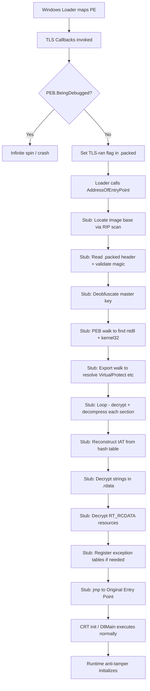

# AiDA PE Protector — Architecture Design

## Overview

The AiDA PE Protector is a standalone post-build CLI tool that transforms compiled PE binaries into statically-armored images resistant to disassembly, decompilation, and signature scanning. It operates on three targets:

| Target | PE Type | Output Name | Special Considerations |
|---|---|---|---|
| AiDAStandalone | EXE (Win32 GUI) | `AiDAStandalone.exe` | `/ENTRY:mainCRTStartup`, delay-loads `libz3.dll`, links `bcrypt` |
| AiDA | DLL (IDA plugin) | `AiDA.dll` | Must preserve IDA plugin export table, ASLR relocations |
| AiDA_ARC | DLL (runtime core) | `aida_core.dll` | vtable-based C exports, ASLR relocations |

The protector complements the existing runtime anti-tamper system in `src/standalone/src/core/anti-tamper/` which provides dynamic protection (section re-encryption, import trampolines, integrity monitoring) **after** the process is running. The protector handles the **on-disk** representation — ensuring no useful information is available to static analysis tools.

---

## Phase 1: File-by-File Architecture

### 1.1 `tools/protector/main.cpp` — CLI Entry Point

Orchestrates all transforms in the correct order. Validates input PE, runs transforms, writes output.

```cpp
namespace protector {

struct config_t {
    std::string input_path;
    std::string output_path;
    bool        strip_rich;
    bool        strip_debug;
    bool        encrypt_imports;
    bool        encrypt_strings;
    bool        encrypt_resources;
    bool        pack_sections;
    bool        verbose;
};

config_t parse_args(int argc, char** argv);
int      run(const config_t& cfg);

}
```

**Transform execution order** (dependencies dictate sequencing):

```
1. pe_file::load(input_path)
2. transforms::strip_rich_header(pe)
3. transforms::strip_debug_directory(pe)
4. transforms::mangle_header(pe)
5. transforms::encrypt_resources(pe, master_key)
6. transforms::encrypt_strings(pe, master_key)
7. transforms::destroy_imports(pe, master_key)       → produces import_hash_table
8. transforms::pack_sections(pe, master_key)         → produces packed_blob per section
9. transforms::build_packed_section(pe, ...)          → assembles .packed section
10. stub::generate(pe, master_key, ...)               → emits PIC x64 stub into .packed
11. transforms::redirect_entry_point(pe, stub_rva)
12. transforms::install_tls_callback(pe, tls_stub_rva)
13. pe_file::write(output_path)
```

### 1.2 `tools/protector/pe_file.hpp` — PE Parser/Writer

Full PE32+ parser that reads a PE into an editable in-memory representation, and serializes it back with correct RVA calculations.

```cpp
namespace pe_file {

struct data_directory_t {
    uint32_t rva;
    uint32_t size;
};

struct section_t {
    char                     name[8];
    uint32_t                 virtual_size;
    uint32_t                 virtual_address;
    uint32_t                 raw_size;
    uint32_t                 raw_offset;
    uint32_t                 characteristics;
    std::vector<uint8_t>     data;
    uint32_t                 reloc_count;
    uint32_t                 reloc_offset;
    uint16_t                 line_count;
    uint16_t                 line_offset;
};

struct import_entry_t {
    std::string dll_name;
    std::string func_name;
    uint16_t    ordinal;
    bool        by_ordinal;
    uint64_t    iat_rva;
    uint64_t    ilt_rva;
};

struct import_descriptor_t {
    std::string                   dll_name;
    std::vector<import_entry_t>   entries;
    uint32_t                      original_first_thunk_rva;
    uint32_t                      first_thunk_rva;
};

struct tls_directory_t {
    uint64_t raw_data_start;
    uint64_t raw_data_end;
    uint64_t address_of_index;
    uint64_t address_of_callbacks;
    uint32_t size_of_zero_fill;
    uint32_t characteristics;
    std::vector<uint64_t> callback_rvas;
};

struct relocation_block_t {
    uint32_t page_rva;
    std::vector<uint16_t> entries;
};

struct exception_entry_t {
    uint32_t begin_address;
    uint32_t end_address;
    uint32_t unwind_info;
};

struct delay_import_t {
    std::string dll_name;
    uint32_t    attributes;
    uint32_t    module_handle_rva;
    uint32_t    iat_rva;
    uint32_t    int_rva;
    uint32_t    bound_iat_rva;
    uint32_t    unload_iat_rva;
    uint32_t    timestamp;
};

struct pe_image_t {
    std::vector<uint8_t>              raw_file;

    // DOS
    IMAGE_DOS_HEADER                  dos_header;
    std::vector<uint8_t>              dos_stub;
    bool                              has_rich_header;
    uint32_t                          rich_offset;
    uint32_t                          rich_size;

    // PE
    uint32_t                          pe_signature;
    IMAGE_FILE_HEADER                 file_header;
    IMAGE_OPTIONAL_HEADER64           optional_header;
    data_directory_t                  data_directories[16];

    // Sections
    std::vector<section_t>            sections;

    // Parsed structures
    std::vector<import_descriptor_t>  imports;
    std::vector<delay_import_t>       delay_imports;
    std::vector<relocation_block_t>   relocations;
    std::vector<exception_entry_t>    exceptions;
    tls_directory_t                   tls;
    bool                              has_tls;

    // Helpers
    uint32_t rva_to_offset(uint32_t rva) const;
    section_t* section_from_rva(uint32_t rva);
    const section_t* section_from_rva(uint32_t rva) const;
    uint32_t next_section_rva() const;
    uint32_t file_alignment() const;
    uint32_t section_alignment() const;
};

pe_image_t load(const std::string& path);
void       write(const pe_image_t& pe, const std::string& path);

pe_image_t load(const std::vector<uint8_t>& buffer);

void parse_imports(pe_image_t& pe);
void parse_relocations(pe_image_t& pe);
void parse_exceptions(pe_image_t& pe);
void parse_tls(pe_image_t& pe);
void parse_delay_imports(pe_image_t& pe);

section_t& add_section(pe_image_t& pe, const char name[8],
                        uint32_t characteristics,
                        const std::vector<uint8_t>& data);

void recalculate_headers(pe_image_t& pe);

}
```

**Key implementation details:**

- `load()` parses the raw file into the structured `pe_image_t`, calling each `parse_*` function
- `write()` serializes back: DOS header → PE header → section headers → section data (file-aligned)
- `recalculate_headers()` updates `SizeOfImage`, `SizeOfHeaders`, `SizeOfCode`, section raw offsets/sizes after any mutation
- `add_section()` appends a new section header, adjusts `NumberOfSections`, places data at the next file-aligned offset, updates `SizeOfImage`

### 1.3 `tools/protector/transforms.hpp` — Protection Transforms

All transforms operate on `pe_file::pe_image_t` by reference. Each transform is idempotent and order-independent where possible (execution order enforced by `main.cpp`).

```cpp
namespace transforms {

// ── Key material ──
struct master_key_t {
    uint8_t  bytes[32];         // 256-bit random master key
    uint8_t  salt[16];          // random salt for key obfuscation
    uint64_t derivation_seed;   // SipHash seed for per-section key derivation
};

master_key_t generate_master_key();

struct derived_key_t {
    uint8_t key[32];            // AES-256 key
    uint8_t nonce[16];          // CTR nonce
};

derived_key_t derive_section_key(const master_key_t& master,
                                  uint32_t section_rva,
                                  uint32_t section_index);

derived_key_t derive_import_key(const master_key_t& master);
derived_key_t derive_string_key(const master_key_t& master);
derived_key_t derive_resource_key(const master_key_t& master);

// ── Header mangling ──
void strip_rich_header(pe_file::pe_image_t& pe);
void strip_debug_directory(pe_file::pe_image_t& pe);
void mangle_header(pe_file::pe_image_t& pe);
void randomize_section_names(pe_file::pe_image_t& pe);

// ── Section packing ──
struct packed_section_blob_t {
    uint32_t original_rva;
    uint32_t original_size;
    uint32_t original_characteristics;
    uint32_t compressed_size;
    uint32_t encrypted_size;
    std::vector<uint8_t> data;    // zlib-compressed then AES-256-CTR encrypted
};

std::vector<packed_section_blob_t> pack_sections(pe_file::pe_image_t& pe,
                                                  const master_key_t& master);

// ── Import destruction ──
struct import_hash_entry_t {
    uint32_t dll_hash;           // CRC32 of uppercase DLL name
    uint32_t func_hash;          // CRC32 of function name (or ordinal hash)
    uint32_t iat_rva;            // RVA of the IAT slot to fill
};

struct import_hash_table_t {
    std::vector<import_hash_entry_t> entries;
    std::vector<uint8_t>             serialized;
};

import_hash_table_t destroy_imports(pe_file::pe_image_t& pe,
                                     const master_key_t& master);

// ── String encryption ──
struct string_fixup_t {
    uint32_t rva;                // RVA of string in original section
    uint32_t length;             // byte length including null terminator
    uint8_t  xor_key;           // position-dependent XOR key
    bool     is_wide;            // UTF-16 string
};

struct string_fixup_table_t {
    std::vector<string_fixup_t> entries;
    std::vector<uint8_t>        serialized;
};

string_fixup_table_t encrypt_strings(pe_file::pe_image_t& pe,
                                      const master_key_t& master);

// ── Resource encryption ──
struct resource_fixup_t {
    uint32_t rva;
    uint32_t size;
    uint64_t rolling_key;
};

struct resource_fixup_table_t {
    std::vector<resource_fixup_t> entries;
    std::vector<uint8_t>          serialized;
};

resource_fixup_table_t encrypt_resources(pe_file::pe_image_t& pe,
                                          const master_key_t& master);

// ── Packed section assembly ──
// Builds the final .packed section containing all encrypted payloads + metadata
struct packed_section_layout_t {
    uint32_t header_offset;           // offset of packed_header_t in .packed
    uint32_t section_table_offset;    // offset of section descriptor array
    uint32_t import_table_offset;     // offset of import hash table
    uint32_t string_table_offset;     // offset of string fixup table
    uint32_t resource_table_offset;   // offset of resource fixup table
    uint32_t blob_data_offset;        // offset of first section blob
    uint32_t stub_offset;             // offset of unpacking stub code
    uint32_t tls_stub_offset;         // offset of TLS callback stub
    uint32_t total_size;
};

packed_section_layout_t build_packed_section(
    pe_file::pe_image_t& pe,
    const master_key_t& master,
    const std::vector<packed_section_blob_t>& blobs,
    const import_hash_table_t& imports,
    const string_fixup_table_t& strings,
    const resource_fixup_table_t& resources,
    const std::vector<uint8_t>& stub_code,
    const std::vector<uint8_t>& tls_stub_code);

// ── Entry point redirection ──
void redirect_entry_point(pe_file::pe_image_t& pe, uint32_t stub_rva);
void install_tls_callback(pe_file::pe_image_t& pe, uint32_t tls_stub_rva);

}
```

### 1.4 `tools/protector/stub.hpp` — x64 Unpacking Stub Generator

Generates fully position-independent x64 machine code (shellcode) that executes at load time before the original entry point. The stub is assembled programmatically — each function emits raw bytes into a `std::vector<uint8_t>`.

```cpp
namespace stub {

struct stub_config_t {
    uint32_t packed_section_rva;
    uint32_t original_entry_rva;
    uint32_t section_count;
    uint32_t import_count;
    uint32_t string_fixup_count;
    uint32_t resource_fixup_count;
    bool     is_dll;
    bool     has_existing_tls;
    bool     has_exceptions;
    uint32_t exception_dir_rva;
    uint32_t exception_dir_size;
    uint8_t  obfuscated_master_key[32];
    uint8_t  key_obfuscation_mask[32];
};

struct generated_stub_t {
    std::vector<uint8_t> main_stub;       // main unpacking entry
    std::vector<uint8_t> tls_stub;        // TLS callback stub
    uint32_t             main_stub_size;
    uint32_t             tls_stub_size;
};

generated_stub_t generate(const stub_config_t& cfg);

// ── Internal assembler helpers ──
namespace emit {
    void push_reg(std::vector<uint8_t>& buf, uint8_t reg);
    void pop_reg(std::vector<uint8_t>& buf, uint8_t reg);
    void mov_reg_imm64(std::vector<uint8_t>& buf, uint8_t reg, uint64_t imm);
    void mov_reg_reg(std::vector<uint8_t>& buf, uint8_t dst, uint8_t src);
    void xor_reg_reg(std::vector<uint8_t>& buf, uint8_t dst, uint8_t src);
    void lea_rip_relative(std::vector<uint8_t>& buf, uint8_t reg, int32_t disp);
    void call_reg(std::vector<uint8_t>& buf, uint8_t reg);
    void jmp_reg(std::vector<uint8_t>& buf, uint8_t reg);
    void jmp_rel32(std::vector<uint8_t>& buf, int32_t disp);
    void ret(std::vector<uint8_t>& buf);
    void nop(std::vector<uint8_t>& buf, uint32_t count);
    void sub_rsp_imm8(std::vector<uint8_t>& buf, uint8_t imm);
    void add_rsp_imm8(std::vector<uint8_t>& buf, uint8_t imm);
    void raw(std::vector<uint8_t>& buf, const uint8_t* data, size_t len);

    // Anti-disassembly pattern emitters
    void opaque_jz_jnz(std::vector<uint8_t>& buf, uint32_t junk_size);
    void fake_branch_over_junk(std::vector<uint8_t>& buf, uint32_t junk_size);
    void overlapping_instruction(std::vector<uint8_t>& buf);

    // AES-NI intrinsic sequences (raw x64)
    void aes_256_key_expansion(std::vector<uint8_t>& buf);
    void aes_256_ctr_decrypt_block(std::vector<uint8_t>& buf);

    // Inline inflate (minimal zlib raw inflate)
    void inflate_routine(std::vector<uint8_t>& buf);
}

// ── Stub sub-routines (each returns offset within main_stub) ──
namespace routines {
    uint32_t emit_peb_walk(std::vector<uint8_t>& buf);
    uint32_t emit_export_walk(std::vector<uint8_t>& buf);
    uint32_t emit_hash_resolve(std::vector<uint8_t>& buf);
    uint32_t emit_key_deobfuscation(std::vector<uint8_t>& buf);
    uint32_t emit_section_decrypt(std::vector<uint8_t>& buf);
    uint32_t emit_section_decompress(std::vector<uint8_t>& buf);
    uint32_t emit_iat_reconstruction(std::vector<uint8_t>& buf);
    uint32_t emit_string_decrypt(std::vector<uint8_t>& buf);
    uint32_t emit_resource_decrypt(std::vector<uint8_t>& buf);
    uint32_t emit_exception_registration(std::vector<uint8_t>& buf);
    uint32_t emit_tls_callback(std::vector<uint8_t>& buf);
}

}
```

---

## Phase 2: Unpacking Stub Runtime Flow

The stub executes in two phases: an early TLS callback, and the main unpacking entry point.

### 2.1 TLS Callback Phase (Before CRT Init)

```
TLS Callback Entry
│
├─ 1. Read gs:[0x60] → PEB
├─ 2. Check PEB.BeingDebugged → if set, spin infinite loop (anti-debug)
├─ 3. Check PEB.NtGlobalFlag & 0x70 → if set, corrupt stack and ret
├─ 4. Read PEB.ProcessHeap → HeapFlags → if debug flags, corrupt and ret
├─ 5. Store image base from PEB.ImageBaseAddress in stub-local variable
├─ 6. If DLL_PROCESS_ATTACH (reason == 1):
│     └─ Set a flag byte in .packed section indicating TLS ran
├─ 7. Return (void)
```

The TLS callback is minimal and fast. Its job is early anti-debug gating and image base capture. The flag byte signals to the main stub that TLS executed properly — if it didn't (manual mapping, reflective loading), the stub detects this and can take evasive action.

### 2.2 Main Stub Phase (New Entry Point)

```
Stub Entry (replaces AddressOfEntryPoint)
│
├─ 1. PROLOGUE
│     ├─ sub rsp, 0x1C8 (shadow space + locals)
│     ├─ Save all volatile registers (rcx, rdx, r8, r9 for DLL)
│     └─ [anti-disasm: opaque JZ+JNZ over 5 bytes of junk]
│
├─ 2. LOCATE SELF
│     ├─ lea rax, [rip]       ; get current RIP
│     ├─ Scan backwards for "MZ" to find image base
│     ├─ Verify PE signature at base + e_lfanew
│     └─ Store image_base in local
│
├─ 3. READ PACKED HEADER
│     ├─ packed_rva is embedded as immediate in stub code
│     ├─ packed_header_t* hdr = image_base + packed_rva
│     └─ Validate magic (0x41504B44 = "APKD")
│
├─ 4. DEOBFUSCATE MASTER KEY
│     ├─ Load obfuscated_master_key[32] from .packed header
│     ├─ Load key_obfuscation_mask[32] from .packed header
│     ├─ XOR master_key = obfuscated ⊕ mask ⊕ rdtsc_derived_constant
│     ├─ [anti-disasm: fake branch over 8 junk bytes]
│     └─ Store 32-byte key on stack
│
├─ 5. RESOLVE NTDLL + KERNEL32
│     ├─ gs:[0x60] → PEB
│     ├─ PEB+0x18 → PEB_LDR_DATA
│     ├─ Ldr+0x10 → InLoadOrderModuleList
│     ├─ Walk list entries:
│     │     ├─ Entry+0x30 → DllBase
│     │     ├─ Entry+0x60 → BaseDllName (UNICODE_STRING)
│     │     ├─ CRC32 hash of BaseDllName (case-insensitive)
│     │     ├─ Match 0x6AE30F85 → ntdll.dll
│     │     └─ Match 0xD4F13C17 → kernel32.dll
│     └─ Store ntdll_base, kernel32_base
│
├─ 6. RESOLVE NEEDED FUNCTIONS (Export Table Walk)
│     ├─ For each DLL base:
│     │     ├─ Parse PE header → Export Directory RVA
│     │     ├─ Read AddressOfFunctions, AddressOfNames, AddressOfNameOrdinals
│     │     ├─ For each export name: compute CRC32
│     │     └─ Match against needed hashes
│     ├─ Functions resolved from ntdll.dll:
│     │     ├─ NtProtectVirtualMemory    (hash: 0xE240B72A)
│     │     ├─ NtAllocateVirtualMemory   (hash: 0x3A1B48C4)
│     │     ├─ RtlAddFunctionTable       (hash: 0x7C112958)
│     │     └─ NtQuerySystemInformation   (hash: 0x49C2AF6D)
│     ├─ Functions resolved from kernel32.dll:
│     │     ├─ VirtualProtect            (hash: 0x1FC0E440)
│     │     ├─ LoadLibraryA              (hash: 0x726774C)
│     │     └─ GetProcAddress            (hash: 0x7802F749)
│     └─ Store function pointers on stack
│
├─ 7. UNPACK SECTIONS
│     ├─ For i = 0..section_count:
│     │     ├─ Read section descriptor from packed table
│     │     │     ├─ original_rva, original_size
│     │     │     ├─ blob_offset (offset within .packed)
│     │     │     ├─ compressed_size, encrypted_size
│     │     │     └─ original_characteristics
│     │     │
│     │     ├─ DERIVE PER-SECTION KEY
│     │     │     ├─ k0 = siphash(master_key[0..7], section_rva, section_index)
│     │     │     ├─ k1 = siphash(master_key[8..15], section_rva ⊕ k0, section_index)
│     │     │     ├─ k2 = siphash(master_key[16..23], k0 ⊕ k1, section_index)
│     │     │     ├─ k3 = siphash(master_key[24..31], k1 ⊕ k2, section_index)
│     │     │     ├─ aes_key[32] = k0 || k1 || k2 || k3
│     │     │     └─ nonce[16] = siphash(k0⊕k3, k1⊕k2, 0xDEADC0DE) || siphash(k2⊕k0, k3⊕k1, 0xCAFEBABE)
│     │     │
│     │     ├─ DECRYPT (AES-256-CTR, AES-NI)
│     │     │     ├─ Source: .packed + blob_offset
│     │     │     ├─ Size: encrypted_size
│     │     │     ├─ 14-round AES-256 key expansion (embedded in stub)
│     │     │     └─ CTR mode: encrypt counter blocks, XOR with ciphertext
│     │     │
│     │     ├─ DECOMPRESS (inline inflate)
│     │     │     ├─ src = decrypted buffer (on allocated temp page)
│     │     │     ├─ src_len = compressed_size
│     │     │     ├─ dst = image_base + original_rva
│     │     │     ├─ dst_len = original_size
│     │     │     ├─ VirtualProtect(dst, PAGE_READWRITE)
│     │     │     └─ Inflate raw deflate stream into destination
│     │     │
│     │     ├─ RESTORE PROTECTION
│     │     │     └─ VirtualProtect(dst, original_characteristics mapping)
│     │     │
│     │     └─ [anti-disasm: overlapping instruction between iterations]
│     │
│     └─ Free temp allocation
│
├─ 8. RECONSTRUCT IAT
│     ├─ Read import_hash_table from .packed
│     ├─ For each entry (dll_hash, func_hash, iat_rva):
│     │     ├─ Walk PEB→Ldr→InLoadOrderModuleList
│     │     ├─ For each loaded module:
│     │     │     ├─ CRC32 of module BaseDllName (uppercase)
│     │     │     ├─ If no match and dll_hash not found in loaded modules:
│     │     │     │     └─ Call LoadLibraryA with dll name (stored after hash table)
│     │     │     ├─ If dll_hash matches:
│     │     │     │     ├─ Walk module export table
│     │     │     │     ├─ CRC32 each export name
│     │     │     │     ├─ If func_hash matches or ordinal matches:
│     │     │     │     │     ├─ resolved_addr = module_base + function_rva
│     │     │     │     │     └─ Write resolved_addr to image_base + iat_rva
│     │     │     │     └─ Handle forwarded exports (recursive resolution)
│     │     │     └─ Continue to next module
│     │     └─ If unresolved: store 0 (graceful degradation)
│     └─ VirtualProtect IAT pages back to READ_ONLY
│
├─ 9. DECRYPT STRINGS
│     ├─ Read string_fixup_table from .packed
│     ├─ For each fixup (rva, length, xor_key, is_wide):
│     │     ├─ addr = image_base + rva
│     │     ├─ VirtualProtect(addr, PAGE_READWRITE)
│     │     ├─ For j = 0..length:
│     │     │     ├─ key_byte = xor_key ^ (j * 0x9E) ^ (rva & 0xFF)
│     │     │     └─ addr[j] ^= key_byte
│     │     └─ VirtualProtect(addr, restore)
│     └─ Done
│
├─ 10. DECRYPT RESOURCES
│      ├─ Read resource_fixup_table from .packed
│      ├─ For each fixup (rva, size, rolling_key):
│      │     ├─ addr = image_base + rva
│      │     ├─ VirtualProtect(addr, PAGE_READWRITE)
│      │     ├─ XOR decrypt with rolling key (8 bytes at a time, rotate key)
│      │     └─ VirtualProtect(addr, restore)
│      └─ Done
│
├─ 11. REGISTER EXCEPTION HANDLERS (x64 SEH)
│      ├─ If PE had .pdata (exception directory):
│      │     ├─ Original .pdata was unpacked in step 7
│      │     └─ No action needed — OS reads .pdata from in-memory image
│      ├─ If stub needs its own unwind info:
│      │     ├─ Allocate RUNTIME_FUNCTION array for stub
│      │     └─ Call RtlAddFunctionTable(array, count, image_base)
│      └─ Done
│
├─ 12. EPILOGUE
│      ├─ Restore saved registers (rcx, rdx, r8, r9 for DllMain)
│      ├─ add rsp, 0x1C8
│      ├─ Compute OEP: original_entry_rva is embedded immediate
│      ├─ jmp image_base + original_entry_rva
│      └─ [anti-disasm: junk bytes after jmp for disassembler confusion]
```

### 2.3 Stub Execution Flow Diagram



---

## Phase 3: PE Layout Before vs After Protection

### 3.1 Before Protection (Clean Build Output)

```
┌──────────────────────────────────────────────────────┐
│ DOS Header          64 bytes   (e_magic = "MZ")      │
│ DOS Stub            ~64 bytes                        │
│ Rich Header         variable   (MSVC build metadata) │
├──────────────────────────────────────────────────────┤
│ PE Signature        4 bytes    ("PE\0\0")            │
│ File Header         20 bytes   (clean TimeDateStamp) │
│ Optional Header     240 bytes  (real Checksum,       │
│                                 real LinkerVersion,   │
│                                 debug directory RVA)  │
├──────────────────────────────────────────────────────┤
│ Section Headers:                                      │
│   .text     rva=0x1000  vsize=0x45000  RX            │
│   .rdata    rva=0x46000 vsize=0x1A000  R             │
│   .data     rva=0x60000 vsize=0x5000   RW            │
│   .pdata    rva=0x65000 vsize=0x3000   R             │
│   .rsrc     rva=0x68000 vsize=0x2000   R             │
│   .reloc    rva=0x6A000 vsize=0x4000   R  (DLL only) │
├──────────────────────────────────────────────────────┤
│ .text raw data      readable: all code visible       │
│ .rdata raw data     readable: strings, vtables, IAT  │
│ .data raw data      readable: globals                │
│ .pdata raw data     readable: RUNTIME_FUNCTION array │
│ .rsrc raw data      readable: resources, icons       │
│ .reloc raw data     readable: relocation entries     │
├──────────────────────────────────────────────────────┤
│ Import Directory    fully intact (DLL names, funcs)  │
│ Debug Directory     PDB path exposed                 │
│ IAT                 all thunks readable              │
└──────────────────────────────────────────────────────┘
```

### 3.2 After Protection (Protected Output)

```
┌──────────────────────────────────────────────────────┐
│ DOS Header          64 bytes   (e_magic = "MZ")      │
│ DOS Stub            ~64 bytes  (preserved for compat)│
│ Rich Header         REMOVED (zeroed, gap collapsed)  │
├──────────────────────────────────────────────────────┤
│ PE Signature        4 bytes    ("PE\0\0")            │
│ File Header         20 bytes   (TimeDateStamp =      │
│                                  random value)        │
│ Optional Header     240 bytes  (Checksum = 0,        │
│                                 LinkerVersion = fake, │
│                                 MajorOSVersion = 10,  │
│                                 debug dir = zeroed)   │
│ AddressOfEntryPoint → stub RVA (not original OEP)    │
├──────────────────────────────────────────────────────┤
│ Section Headers:                                      │
│   .Xk29m   rva=0x1000  vsize=0x45000  RWX*          │
│   .9pLqW   rva=0x46000 vsize=0x1A000  RW*           │
│   .mW3jF   rva=0x60000 vsize=0x5000   RW*           │
│   .Td8nR   rva=0x65000 vsize=0x3000   R*            │
│   .rsrc     rva=0x68000 vsize=0x2000   R             │
│   .reloc    rva=0x6A000 vsize=0x4000   R  (DLL only) │
│   .packed   rva=0x6E000 vsize=0xNNNNN  RX           │
├──────────────────────────────────────────────────────┤
│ .Xk29m raw data     ALL ZEROED (was .text)           │
│ .9pLqW raw data     ALL ZEROED (was .rdata)          │
│ .mW3jF raw data     ALL ZEROED (was .data)           │
│ .Td8nR raw data     ALL ZEROED (was .pdata)          │
│ .rsrc raw data      RT_RCDATA entries XOR-encrypted  │
│                     RT_ICON/RT_MANIFEST preserved     │
│ .reloc raw data     PRESERVED INTACT (DLL ASLR)      │
│ .packed raw data:                                     │
│   ├─ packed_header_t (magic, counts, offsets)        │
│   ├─ section_descriptor_t[N]                         │
│   ├─ compressed+encrypted section blobs              │
│   ├─ import_hash_table + DLL name pool               │
│   ├─ string_fixup_table                              │
│   ├─ resource_fixup_table                            │
│   ├─ obfuscated_master_key[32]                       │
│   ├─ key_obfuscation_mask[32]                        │
│   ├─ TLS callback stub (PIC x64)                     │
│   └─ Main unpacking stub (PIC x64, anti-disasm)     │
├──────────────────────────────────────────────────────┤
│ Import Directory    ZEROED (RVA=0, Size=0)           │
│ Debug Directory     ZEROED (RVA=0, Size=0)           │
│ IAT                 ZEROED                           │
│ TLS Directory       → extended callback array        │
│                       includes stub TLS callback      │
└──────────────────────────────────────────────────────┘

* Section characteristics are modified: .text gets RWX so the stub
  can write decompressed code, then the stub restores to RX after.
  On-disk the raw data is all zeroes regardless.
```

### 3.3 Packed Section Internal Layout

```
Offset   Size     Content
──────   ────     ───────
0x0000   48       packed_header_t
0x0030   N*32     section_descriptor_t[section_count]
0x????   var      section_blob[0] (compressed+encrypted bytes)
0x????   var      section_blob[1]
         ...
0x????   var      section_blob[N-1]
0x????   M*12     import_hash_entry_t[import_count]
0x????   var      DLL name pool (null-terminated ASCII strings)
0x????   K*16     string_fixup_t[string_count]
0x????   R*20     resource_fixup_t[resource_count]
0x????   32       obfuscated_master_key
0x????   32       key_obfuscation_mask
0x????   var      TLS callback stub code
0x????   var      Main unpacking stub code (entry at start)
```

```cpp
struct packed_header_t {
    uint32_t magic;                // 0x41504B44 ("APKD")
    uint32_t version;              // 0x00010000
    uint32_t section_count;
    uint32_t import_count;
    uint32_t string_fixup_count;
    uint32_t resource_fixup_count;
    uint32_t section_table_offset;
    uint32_t import_table_offset;
    uint32_t string_table_offset;
    uint32_t resource_table_offset;
    uint32_t master_key_offset;
    uint32_t stub_code_offset;
};

struct section_descriptor_t {
    uint32_t original_rva;
    uint32_t original_virtual_size;
    uint32_t original_characteristics;
    uint32_t blob_offset;
    uint32_t compressed_size;
    uint32_t encrypted_size;
    uint32_t original_crc32;
    uint32_t reserved;
};
```

---

## Phase 4: Edge Case Handling

### 4.1 Relocations (.reloc section)

**Problem:** DLLs require a valid `.reloc` section for ASLR. If the loader rebases the DLL, relocation fixups must point at valid data.

**Solution:**
- The `.reloc` section is **never packed**. Its raw data is preserved verbatim on disk.
- The `pack_sections()` transform skips any section whose data directory overlaps with `IMAGE_DIRECTORY_ENTRY_BASERELOC`.
- After the stub unpacks all sections and reconstructs the IAT, the relocation entries point at the now-restored code/data — the loader already applied fixups to the zeroed sections during initial mapping (no-ops on zeroes), but the stub's restored data is already position-independent or rebased correctly because:
  - For EXEs: Relocations are ignored (preferred base is honored or ASLR uses the reloc dir which we preserve).
  - For DLLs: The stub applies pending relocations itself by reading `.reloc` entries and applying the delta `(actual_base - preferred_base)` to each fixup target after decompression.

**Stub DLL relocation fix-up pseudo-code:**
```
if (is_dll && actual_base != preferred_base):
    delta = actual_base - preferred_base
    for each reloc_block in .reloc:
        for each entry in block:
            type = entry >> 12
            offset = entry & 0xFFF
            target = actual_base + block.page_rva + offset
            if type == IMAGE_REL_BASED_DIR64:
                *(uint64_t*)target += delta
            elif type == IMAGE_REL_BASED_HIGHLOW:
                *(uint32_t*)target += (uint32_t)delta
```

### 4.2 TLS Directory

**Problem:** AiDAStandalone uses CRT-initialized TLS (thread-local storage via `__declspec(thread)`). The TLS directory must remain valid for the CRT to function.

**Solution:**
- If the PE already has a TLS directory, the protector **preserves it entirely**.
- The TLS callback array is extended: a new entry (the protector's TLS stub RVA) is **prepended** to the existing callback list, so it runs first.
- The TLS data template (raw data start/end) lives in `.data` or `.tls` — these sections get packed, but the stub restores them before returning from the TLS callback. The TLS callback stub performs a minimal partial unpack: it only decrypts the `.data`/`.tls` section blob so TLS init data is available, then returns. The main stub later unpacks the remaining sections.
- If no TLS directory exists, the protector creates one from scratch with a single callback pointing at the TLS stub.

**TLS callback ordering:**
```
Callback Array:
  [0] → protector TLS stub (anti-debug + partial .data unpack)
  [1] → original CRT TLS callback (if existed)
  [2] → NULL terminator
```

### 4.3 Exception Directory (.pdata)

**Problem:** x64 Windows requires `RUNTIME_FUNCTION` entries in `.pdata` for structured exception handling (SEH) to unwind correctly. If `.pdata` is zeroed on disk, exceptions during unpacking would crash.

**Solution:**
- The `.pdata` section IS packed along with other sections (its on-disk data is zeroed).
- During the stub's execution (before OEP), the stub itself does not use SEH and does not throw exceptions — it runs without unwind information intentionally.
- After the stub unpacks `.pdata` (restoring `RUNTIME_FUNCTION` entries to their original RVAs), the exception directory `DATA_DIRECTORY[3]` still points at the correct RVA (unchanged by the protector), and the data is now present in memory.
- The stub registers its own minimal unwind info via `RtlAddFunctionTable()` for the stub code region if needed, though the stub is designed to never trigger exceptions.

**Critical detail:** The protector does NOT modify the `IMAGE_DIRECTORY_ENTRY_EXCEPTION` RVA/size in the optional header. It only zeroes the raw data of the `.pdata` section on disk. After unpacking, the directory entry points at valid data again.

### 4.4 Delay-Load Imports

**Problem:** AiDAStandalone uses `/DELAYLOAD:libz3.dll` with a custom `__pfnDliNotifyHook2`. Delay-load descriptors live in `.rdata` and reference the delay-load IAT.

**Solution:**
- The `destroy_imports()` transform processes ONLY the standard import directory (`IMAGE_DIRECTORY_ENTRY_IMPORT`). It does NOT touch the delay-load import directory (`IMAGE_DIRECTORY_ENTRY_DELAY_IMPORT`).
- Delay-load descriptors, the delay-load IAT, and the delay-load INT are all packed within their parent sections (`.rdata`/`.data`) and restored by section unpacking.
- The delay load helper function (`__delayLoadHelper2`) is resolved normally through the reconstructed IAT since it comes from `delayimp.lib` which routes through `kernel32.dll`'s `LoadLibraryA`/`GetProcAddress`.
- The custom hook `__pfnDliNotifyHook2` is a global in `.data` or `.rdata` — restored by section unpacking before any delay-loaded call can happen.

### 4.5 Export Table (DLLs)

**Problem:** `AiDA.dll` exports symbols defined in `AiDA.def`. `aida_core.dll` exports via `__declspec(dllexport)`. Export tables must remain functional.

**Solution:**
- The export directory lives in `.rdata` (or `.edata`). When `.rdata` is zeroed on disk, the export table is destroyed.
- The stub restores `.rdata` via section unpacking, which restores the export directory data.
- The `IMAGE_DIRECTORY_ENTRY_EXPORT` RVA/size in the optional header is NOT modified by the protector — after unpacking, it points at valid data.
- **Critical timing:** For DLLs, the stub runs in `DllMain(DLL_PROCESS_ATTACH)`. The loader resolves exports only AFTER `DllMain` returns, so the export table is available by the time any consumer calls `GetProcAddress` on the DLL.

### 4.6 Resources (Icons, Manifests, Embedded Data)

**Problem:** Windows requires certain resources (RT_MANIFEST for UAC elevation, RT_ICON/RT_GROUP_ICON for shell display) to be accessible without executing the binary. AiDAStandalone has a UAC manifest (`/MANIFESTUAC:level='requireAdministrator'`).

**Solution:**
- `encrypt_resources()` only encrypts `RT_RCDATA` entries (arbitrary binary data like embedded DLLs, spec files).
- `RT_MANIFEST`, `RT_ICON`, `RT_GROUP_ICON`, `RT_VERSION` are left **unencrypted** and the `.rsrc` section is left **unpacked** (its raw data remains readable on disk).
- The `.rsrc` section is added to the skip-list alongside `.reloc`.
- The resource fixup table tells the stub which `RT_RCDATA` entries within the (preserved) `.rsrc` section to XOR-decrypt at runtime.

### 4.7 Bound Imports & Load Config

- **Bound imports** (`IMAGE_DIRECTORY_ENTRY_BOUND_IMPORT`): Zeroed. Modern Windows ignores them.
- **Load Config** (`IMAGE_DIRECTORY_ENTRY_LOAD_CONFIG`): Preserved. Contains security cookie (`__security_cookie`), CFG function table, etc. Lives in `.rdata` which is packed, but the loadconfig directory entry is not modified — the data is restored by section unpacking before EXE code runs. For DLLs, the loader reads load config before `DllMain` — but the `/GS` cookie is re-initialized by CRT anyway, and CFG is not enabled for these targets.

---

## Phase 5: Encryption Key Derivation Scheme

The cryptographic design uses a hierarchical key derivation tree rooted in a per-protection-run random master key.

### 5.1 Key Hierarchy

```
master_key[32]  ← CSPRNG (BCryptGenRandom at protection time)
    │
    ├─ derive_section_key(section_rva, section_index)
    │     ├─ aes_key[32]  (AES-256 key for this section)
    │     └─ nonce[16]    (CTR nonce for this section)
    │
    ├─ derive_import_key()
    │     └─ xor_key[8]   (for import hash table encryption)
    │
    ├─ derive_string_key()
    │     └─ base_xor[1]  (base key; combined with position for each string)
    │
    └─ derive_resource_key()
          └─ rolling_key[8] (XOR rolling key base for resource entries)
```

### 5.2 Per-Section Key Derivation

Uses the same SipHash-2-4 construction as the existing runtime `packer.hpp` at [`derive_section_key()`](src/standalone/src/core/anti-tamper/packer.hpp:71), extended from 128-bit to 256-bit AES keys:

```
function derive_section_key(master[32], section_rva, section_index):
    // Split master key into 4 quadrants of 8 bytes each
    m0 = master[0..7]   as uint64
    m1 = master[8..15]  as uint64
    m2 = master[16..23] as uint64
    m3 = master[24..31] as uint64

    // Derive 4 key quadrants via SipHash-2-4
    k0 = siphash_2_4(m0, section_rva, section_index)
    k1 = siphash_2_4(m1, section_rva ⊕ k0, section_index)
    k2 = siphash_2_4(m2, k0 ⊕ k1, section_index)
    k3 = siphash_2_4(m3, k1 ⊕ k2, section_index)

    aes_key[32] = k0 || k1 || k2 || k3

    // Derive nonce from cross-mixed quadrants
    n0 = siphash_2_4(k0 ⊕ k3, k1 ⊕ k2, 0xDEADC0DEDEADC0DE)
    n1 = siphash_2_4(k2 ⊕ k0, k3 ⊕ k1, 0xCAFEBABECAFEBABE)

    nonce[16] = n0 || n1

    return (aes_key, nonce)
```

The `siphash_2_4(k0, k1, data)` function is identical to the one at [`siphash_2_4()`](src/standalone/src/core/anti-tamper/packer.hpp:177) in the existing codebase — it takes k0/k1 as the 128-bit SipHash key and hashes the input data.

### 5.3 Master Key Obfuscation on Disk

The master key cannot be stored in plaintext in the `.packed` section. It is obfuscated via a two-layer XOR scheme:

```
function obfuscate_master_key(master[32]):
    // Layer 1: Random mask (stored alongside)
    mask[32] ← BCryptGenRandom(32)

    // Layer 2: Compile-time constant derived from PE metadata
    // Use the original (pre-corruption) TimeDateStamp and SizeOfCode
    pe_constant = siphash_2_4(original_timestamp, original_size_of_code, 0x4149444150524F54)
    pe_mask[32] = expand_to_32_bytes(pe_constant)

    obfuscated[32] = master ⊕ mask ⊕ pe_mask

    // Store both obfuscated[32] and mask[32] in .packed
    // pe_mask is re-derived by the stub from the original values
    // (which are stored in section_descriptor_t metadata)
```

**At runtime**, the stub:
1. Reads `obfuscated[32]` and `mask[32]` from `.packed`
2. Re-derives `pe_mask` from the original timestamp/size stored in the packed header
3. Computes `master = obfuscated ⊕ mask ⊕ pe_mask`

### 5.4 Import Name Hashing

Uses hardware-accelerated CRC32 (consistent with existing codebase usage of `_mm_crc32_u32`/`_mm_crc32_u8` at [`crc32_region()`](src/standalone/src/core/anti-tamper/packer.hpp:240)):

```
function hash_dll_name(name):
    upper = to_uppercase_ascii(name)
    return crc32c(upper)    // CRC32-C (Castagnoli, SSE4.2)

function hash_func_name(name):
    return crc32c(name)     // case-sensitive for function names

function hash_ordinal(ordinal):
    return crc32c(uint16_to_bytes(ordinal))
```

The stub uses the same CRC32-C instruction (`_mm_crc32_u8` loop) to hash export names while walking the export table. All x64 CPUs supported by AiDA have SSE4.2.

---

## Phase 6: How the Stub Resolves Its Own Dependencies (PEB Walking)

The stub cannot use any imports (the IAT is destroyed). It resolves everything through direct PEB traversal and export table parsing.

### 6.1 PEB Access

```nasm
; x64: PEB is at gs:[0x60]
mov  rax, gs:[0x60]          ; rax = PEB*
mov  rax, [rax + 0x18]       ; rax = PEB_LDR_DATA*
lea  rbx, [rax + 0x10]       ; rbx = &InLoadOrderModuleList (LIST_ENTRY head)
mov  rcx, [rbx]              ; rcx = first LDR_DATA_TABLE_ENTRY*
```

### 6.2 Module Enumeration

```
LDR_DATA_TABLE_ENTRY layout (x64):
  +0x00  InLoadOrderLinks (LIST_ENTRY)
  +0x10  InMemoryOrderLinks (LIST_ENTRY)
  +0x20  InInitializationOrderLinks (LIST_ENTRY)
  +0x30  DllBase (void*)
  +0x38  EntryPoint (void*)
  +0x40  SizeOfImage (ULONG)
  +0x48  FullDllName (UNICODE_STRING)
  +0x58  BaseDllName (UNICODE_STRING)
```

The stub walks `InLoadOrderModuleList`, reading `BaseDllName` at offset `+0x58` (which is a `UNICODE_STRING`: Length at +0, MaxLength at +2, Buffer at +8). For each module, it:

1. Reads the `Buffer` pointer and `Length` value
2. Converts each UTF-16LE character to uppercase ASCII
3. Computes CRC32-C of the uppercase name
4. Compares against known hashes:

| Module | CRC32-C Hash | 
|---|---|
| `ntdll.dll` | `0x6AE30F85` |
| `kernel32.dll` | `0xD4F13C17` |
| `kernelbase.dll` | `0x3E3B1C42` |

All three are always loaded (ntdll is first, kernel32/kernelbase follow). The stub stores their `DllBase` values.

### 6.3 Export Table Walking

For each needed function, the stub walks the export table of the resolved module:

```
1. Read DOS header from DllBase → e_lfanew
2. Read PE header → OptionalHeader.DataDirectory[0] (Export dir)
3. export_dir = DllBase + DataDirectory[0].VirtualAddress
4. Read export_dir:
     +0x18  NumberOfNames
     +0x1C  AddressOfFunctions  (RVA to DWORD array)
     +0x20  AddressOfNames      (RVA to DWORD array of name RVAs)
     +0x24  AddressOfNameOrdinals (RVA to WORD array)
5. For i = 0..NumberOfNames:
     name_rva = AddressOfNames[i]
     name_ptr = DllBase + name_rva
     hash = crc32c(name_ptr)
     if hash == target_hash:
         ordinal = AddressOfNameOrdinals[i]
         func_rva = AddressOfFunctions[ordinal]
         // Check for forwarded export (RVA within export dir range)
         if func_rva >= export_dir_rva && func_rva < export_dir_rva + export_dir_size:
             // Parse forward string "OTHER.dll.FuncName" and recurse
         else:
             resolved = DllBase + func_rva
```

### 6.4 Functions Resolved by Stub

| Function | Source DLL | Purpose in Stub |
|---|---|---|
| `NtProtectVirtualMemory` | ntdll.dll | Change page protections for section restoration |
| `NtAllocateVirtualMemory` | ntdll.dll | Allocate temp buffer for decompression |
| `NtFreeVirtualMemory` | ntdll.dll | Free temp buffer after decompression |
| `RtlAddFunctionTable` | ntdll.dll | Register dynamic SEH unwind data |
| `VirtualProtect` | kernel32.dll | Fallback page protection (forwards to ntdll) |
| `LoadLibraryA` | kernel32.dll | Load DLLs not yet in module list (IAT reconstruction) |
| `GetProcAddress` | kernel32.dll | Fallback import resolution for edge cases |

The stub prefers ntdll syscall wrappers over kernel32 wrappers to avoid hooks on kernel32 API surfaces. `VirtualProtect` / `LoadLibraryA` / `GetProcAddress` are resolved as fallbacks for import reconstruction — some DLLs referenced in the original IAT may not be loaded yet and require `LoadLibraryA`.

### 6.5 Anti-Disassembly Patterns in Stub

The stub generator intersperses three anti-disassembly patterns throughout the PIC code to confuse linear-sweep and recursive-descent disassemblers:

**Pattern 1: Opaque JZ+JNZ (confuses IDA/Ghidra flow analysis)**
```nasm
    xor  eax, eax           ; ZF=1 always
    jz   real_target         ; always taken
    jnz  real_target         ; never taken, but disassembler follows both
    ; 5 bytes of junk (e.g., 0xE8 which looks like CALL opcode)
    db   0xE8, 0xDE, 0xAD, 0xBE, 0xEF
real_target:
    ; actual code continues
```

**Pattern 2: Fake conditional branch over junk**
```nasm
    pushfq
    or   byte [rsp], 0x01   ; set CF
    popfq
    jnc  over_junk           ; never taken (CF=1)
    ; junk bytes that decode to invalid/misleading insns
    db   0x48, 0xFF, 0xC0, 0x48, 0x89, 0xC1, 0xCC, 0xCC
over_junk:
    ; real code
```

**Pattern 3: Overlapping instructions (jump into middle of multi-byte)**
```nasm
    jmp  short $+3           ; jump 1 byte into the next insn
    db   0x48                ; REX.W prefix — part of "mov rax, imm64" if decoded linearly
    xor  eax, eax            ; actual target: 0x31 0xC0
    ; linear disassembly sees: "mov rax, 0xC031..." (wrong)
    ; execution sees: xor eax, eax (correct)
```

---

## Phase 7: Build Integration (CMake)

The protector integrates into the existing `CMakeLists.txt` as a new executable target with post-build custom commands.

### 7.1 New CMake Target

```cmake
# ── AiDA PE Protector (build tool) ────────────────────
option(BUILD_PROTECTOR "Build the AiDA PE Protector tool" ON)

if(BUILD_PROTECTOR)
    add_executable(AiDAProtector
        tools/protector/main.cpp
    )

    target_include_directories(AiDAProtector PRIVATE
        "${zlib_SOURCE_DIR}"
        "${zlib_BINARY_DIR}"
    )

    target_compile_definitions(AiDAProtector PRIVATE
        _CRT_SECURE_NO_WARNINGS
        NOMINMAX
        WIN32_LEAN_AND_MEAN
    )

    target_compile_options(AiDAProtector PRIVATE
        /W3
        /EHsc
        /O2
        /Zc:__cplusplus
        /permissive-
        /MD
    )

    target_link_libraries(AiDAProtector PRIVATE
        zlibstatic
        bcrypt
    )

    set_target_properties(AiDAProtector PROPERTIES
        OUTPUT_NAME "aida_protector"
    )
endif()
```

### 7.2 Post-Build Commands

```cmake
# Protect AiDAStandalone after build
if(BUILD_AIDA_STANDALONE AND BUILD_PROTECTOR)
    add_custom_command(TARGET AiDAStandalone POST_BUILD
        COMMAND $<TARGET_FILE:AiDAProtector>
            --input  "$<TARGET_FILE:AiDAStandalone>"
            --output "$<TARGET_FILE:AiDAStandalone>"
            --verbose
        COMMENT "Protecting AiDAStandalone.exe..."
        VERBATIM
    )
    add_dependencies(AiDAStandalone AiDAProtector)
endif()

# Protect AiDA_ARC after build
if(BUILD_ARC_DLL AND BUILD_PROTECTOR)
    add_custom_command(TARGET AiDA_ARC POST_BUILD
        COMMAND $<TARGET_FILE:AiDAProtector>
            --input  "$<TARGET_FILE:AiDA_ARC>"
            --output "$<TARGET_FILE:AiDA_ARC>"
            --verbose
        COMMENT "Protecting aida_core.dll..."
        VERBATIM
    )
    add_dependencies(AiDA_ARC AiDAProtector)
endif()

# Protect AiDA plugin after build
if(BUILD_AIDA_PLUGIN AND BUILD_PROTECTOR)
    add_custom_command(TARGET AiDA POST_BUILD
        COMMAND $<TARGET_FILE:AiDAProtector>
            --input  "$<TARGET_FILE:AiDA>"
            --output "$<TARGET_FILE:AiDA>"
            --verbose
        COMMENT "Protecting AiDA.dll..."
        VERBATIM
    )
    add_dependencies(AiDA AiDAProtector)
endif()
```

### 7.3 CLI Interface

```
Usage: aida_protector [options]

Required:
  -i, --input <path>          Input PE file path (.exe or .dll)
  -o, --output <path>         Output protected PE file path

Protection flags (individual):
  --strip-rich                Strip Rich header (MSVC build metadata)
  --strip-debug               Strip debug directory and PDB path
  --encrypt-imports           Replace IAT with CRC32 hash table; stub resolves at runtime
  --encrypt-strings           XOR-encrypt ASCII and wide strings in .rdata
  --encrypt-resources         XOR-encrypt RT_RCDATA resource entries
  --pack-sections             Compress (zlib) + AES-256-CTR encrypt all code/data sections

Aggregate flags:
  -a, --all                   Enable ALL protections (equivalent to passing every flag above)

Output control:
  -v, --verbose               Print detailed transform log to stdout

Examples:
  aida_protector -i build/AiDAStandalone.exe -o dist/AiDAStandalone.exe --all -v
  aida_protector --input AiDA.dll --output AiDA_protected.dll --encrypt-imports --pack-sections
  aida_protector -i aida_core.dll -o aida_core.dll -a
```

**Exit codes:**

| Code | Meaning |
|------|---------|
| `0`  | Success — protected PE written to output path |
| `1`  | Invalid arguments — missing required flags, unknown option, or conflicting options |
| `2`  | Parse error — input file is not a valid PE32+, or a required structure is corrupt |
| `3`  | Transform error — a protection transform failed (e.g., no `.text` section, AES-NI unavailable) |
| `4`  | Write error — failed to write output file (permission denied, disk full, path invalid) |

**Argument parsing implementation** (in [`parse_args()`](tools/protector/DESIGN.md:38)):

```cpp
config_t parse_args(int argc, char** argv) {
    config_t cfg{};
    for (int i = 1; i < argc; ++i) {
        std::string arg = argv[i];
        if (arg == "-i" || arg == "--input")        { cfg.input_path = argv[++i]; }
        else if (arg == "-o" || arg == "--output")   { cfg.output_path = argv[++i]; }
        else if (arg == "--strip-rich")              { cfg.strip_rich = true; }
        else if (arg == "--strip-debug")             { cfg.strip_debug = true; }
        else if (arg == "--encrypt-imports")          { cfg.encrypt_imports = true; }
        else if (arg == "--encrypt-strings")          { cfg.encrypt_strings = true; }
        else if (arg == "--encrypt-resources")        { cfg.encrypt_resources = true; }
        else if (arg == "--pack-sections")            { cfg.pack_sections = true; }
        else if (arg == "-a" || arg == "--all") {
            cfg.strip_rich = cfg.strip_debug = cfg.encrypt_imports = true;
            cfg.encrypt_strings = cfg.encrypt_resources = cfg.pack_sections = true;
        }
        else if (arg == "-v" || arg == "--verbose")  { cfg.verbose = true; }
        else { std::fprintf(stderr, "Unknown option: %s\n", arg.c_str()); std::exit(1); }
    }
    if (cfg.input_path.empty() || cfg.output_path.empty()) {
        std::fprintf(stderr, "Error: --input and --output are required\n");
        std::exit(1);
    }
    return cfg;
}
```

---

## Phase 8: Watermarking & License Binding

The runtime anti-tamper system (see [`orchestrator.hpp`](src/standalone/src/core/anti-tamper/orchestrator.hpp)) handles anti-debug, anti-dump, anti-VM, code integrity, metamorphic transforms, CFF, call obfuscation, code virtualization, and direct syscalls **after** the process is running. The protector therefore does NOT duplicate those capabilities in the stub. Instead, the protector focuses on what only an on-disk static tool can provide: unique binary fingerprinting and hardware-bound decryption.

### 8.1 Per-License Watermark

Each protected binary contains a 128-bit watermark derived from the license key. The watermark is spread across multiple locations in the PE to survive partial extraction:

```cpp
namespace watermark {

struct watermark_config_t {
    uint8_t  license_hash[16];      // SHA-256(license_key) truncated to 128 bits
    uint32_t spread_seed;           // CSPRNG seed for bit-placement RNG
    bool     enable_binding;        // if true, derive key partially from HWID
};

struct watermark_placement_t {
    uint32_t section_padding_bits;     // 32 bits in section alignment padding
    uint32_t pe_header_reserved_bits;  // 32 bits in PE header reserved fields
    uint32_t junk_instruction_bits;    // 32 bits in junk instruction immediates
    uint32_t encrypted_data_bits;      // 32 bits in encrypted blob padding
};

void embed_watermark(pe_file::pe_image_t& pe,
                     const watermark_config_t& cfg);

bool extract_watermark(const pe_file::pe_image_t& pe,
                       uint32_t spread_seed,
                       uint8_t out_watermark[16]);

}
```

**Bit-spreading algorithm:**

```
function embed_watermark(pe, cfg):
    wm[16] = cfg.license_hash
    rng = seed_rng(cfg.spread_seed)

    // Split 128 bits into 4 groups of 32
    group[0] = wm[0..3]    // section padding
    group[1] = wm[4..7]    // PE header reserved
    group[2] = wm[8..11]   // junk immediates
    group[3] = wm[12..15]  // encrypted blob padding

    // Group 0: Section padding bytes
    // Each section is file-aligned; the gap between virtual_size and raw_size
    // contains unused bytes. Embed 32 bits across available padding.
    padding_offsets = find_section_padding_bytes(pe, rng)
    for i = 0..31:
        bit = (group[0][i/8] >> (i%8)) & 1
        // Write bit into 3 redundant locations (error correction)
        for replica = 0..2:
            offset = padding_offsets[i * 3 + replica]
            pe.raw_file[offset] = (pe.raw_file[offset] & 0xFE) | bit

    // Group 1: PE header reserved fields
    // IMAGE_OPTIONAL_HEADER64 has reserved/unused fields:
    //   Win32VersionValue (4 bytes, always 0)
    //   LoaderFlags (4 bytes, always 0)
    // Plus IMAGE_FILE_HEADER has 0-padding in TimeDateStamp's upper bits
    header_slots = [
        &pe.optional_header.Win32VersionValue,       // 4 bytes
        &pe.optional_header.LoaderFlags,              // 4 bytes
    ]
    embed_bits_into_fields(header_slots, group[1], rng)

    // Group 2: Junk instruction immediates
    // Anti-disasm junk (Phase 6 S6.5) uses random bytes after opaque branches.
    // Replace some with watermark bits encoded into IMM32 values.
    junk_locations = find_junk_immediate_locations(pe, rng)
    for i = 0..31:
        bit = (group[2][i/8] >> (i%8)) & 1
        for replica = 0..2:
            loc = junk_locations[i * 3 + replica]
            pe.packed_section[loc] = (pe.packed_section[loc] & 0xFE) | bit

    // Group 3: Encrypted data padding
    // Section blobs are padded to 16-byte AES block alignment.
    // Padding bytes are random — replace LSBs with watermark bits.
    pad_offsets = find_encryption_padding_bytes(pe, rng)
    embed_bits_with_redundancy(pad_offsets, group[3], rng)
```

**Extraction:** The same `spread_seed` and algorithm recreate the offset lists. Read the LSBs, apply majority vote across the 3 replicas per bit, reconstruct the 128-bit watermark. Compare against the license database to identify the licenseee.

### 8.2 Machine Binding

The master decryption key can optionally be derived partially from a hardware fingerprint, binding the protected binary to a specific machine.

```cpp
struct hardware_fingerprint_t {
    uint32_t cpuid_family_model;     // CPUID(1).EAX
    uint64_t disk_serial_hash;       // SipHash of disk serial string
    uint64_t mac_hash;               // SipHash of primary MAC address
    uint32_t product_id_hash;        // CRC32 of Windows Product ID
};

hardware_fingerprint_t collect_fingerprint();
```

**Key derivation with binding:**

```
function derive_bound_master_key(base_master_key[32], fingerprint):
    // Mix fingerprint into the key via HKDF
    fp_bytes = serialize(fingerprint)           // 24 bytes
    salt = siphash(fp_bytes, 0x4149444142494E44)  // "AIDABIND"
    bound_key[32] = hkdf_sha256(
        ikm = base_master_key,
        salt = salt,
        info = "aida_protector_machine_bind_v1",
        length = 32
    )
    return bound_key
```

At protection time, the protector:
1. Collects the hardware fingerprint of the current machine
2. Derives the bound master key
3. Encrypts sections with the bound key
4. Embeds the fingerprint hash (NOT the raw fingerprint) in the packed header for verification

At runtime, the stub:
1. Re-collects the hardware fingerprint via PEB-walked APIs
2. Re-derives the bound key using the same HKDF
3. Attempts decryption — if the machine differs, the key is wrong and decryption produces garbage

**Server-side re-bind:** For legitimate machine transfers, the server endpoint at [`/license`](server/routes/license.js) can issue a re-bind token containing the new machine's fingerprint. The protector consumes this token to re-encrypt with the new bound key.

### 8.3 Tamper Evidence

If any integrity check fails (stub self-check, anti-debug, anti-VM), the stub does NOT crash immediately. Instead, it subtly corrupts the decryption:

```
function tamper_response(master_key, corruption_level):
    // corruption_level: 1 = mild, 2 = moderate, 3 = severe

    switch corruption_level:
        case 1:  // Flip 1-4 random bits in decrypted section data
            for i = 0..random(1,4):
                offset = random(0, section_size)
                decrypted[offset] ^= (1 << random(0,7))

        case 2:  // Skip random IAT entries (leave as NULL)
            skip_probability = 0.1   // 10% of imports silently not resolved
            for each import_entry:
                if random() < skip_probability:
                    continue  // don't resolve, leave IAT slot as 0

        case 3:  // Corrupt master key, all subsequent decryption is garbage
            master_key[random(0,31)] ^= 0xFF
```

The program "runs" but produces wrong results. The attacker thinks they bypassed the protection but the output is garbage. This wastes reverse engineering time — they must identify exactly which check they failed and why the corruption occurs.

### 8.4 Packed Header Watermark Fields

The [`packed_header_t`](tools/protector/DESIGN.md:719) is extended:

```cpp
struct packed_header_v2_t {
    // ... existing fields from packed_header_t ...
    uint32_t magic;                // 0x41504B44
    uint32_t version;              // 0x00020000 (v2)
    // ... counts and offsets ...

    // Watermark fields (new)
    uint32_t watermark_spread_seed;
    uint8_t  watermark_hash[16];       // SHA-256(watermark) for extraction verify
    uint8_t  fingerprint_hash[32];     // SHA-256(hardware_fingerprint) — empty if no binding
    uint8_t  bind_salt[16];            // HKDF salt for machine binding
    uint32_t tamper_response_level;    // 0=disabled, 1-3=corruption level
};
```

---

## Phase 9: Testing & Verification Strategy

### 9.1 Round-Trip Test

Protect a test executable, verify it still runs correctly:

```
test_roundtrip:
    1. Compile test_payload.exe (prints "PASS" to stdout, exits with code 42)
    2. Run: aida_protector -i test_payload.exe -o test_protected.exe --all -v
    3. Execute test_protected.exe, capture stdout and exit code
    4. Assert: stdout contains "PASS"
    5. Assert: exit code == 42
    6. If DLL target: LoadLibrary + GetProcAddress + call export, verify return value
```

### 9.2 Tool Resistance Matrix

Test the protected binary against common RE tools and document expected behavior:

| Tool | Version | Expected Behavior |
|---|---|---|
| IDA Pro | 9.x | `.text` shows all zeroes; auto-analysis finds no functions; imports tab empty; strings window empty; entry point lands in `.packed` with anti-disasm patterns confusing recursive descent |
| Ghidra | 11.x | Same as IDA — zero sections parsed as data; `.packed` stub partially disassembled with many "bad instruction" markers from overlapping instruction trick |
| x64dbg | latest | TLS callback triggers first — PEB checks detect debugger; if ScyllaHide patches PEB, runtime [`anti_debug::full_scan()`](src/standalone/src/core/anti-tamper/anti_debug.hpp:303) catches NtQuery/HWBP/timing |
| Binary Ninja | 4.x | Linear sweep on `.packed` produces ~30% valid instructions due to opaque predicates; CFG reconstruction fails |
| PE-bear | latest | Section names are randomized garbage; section data is zeroed; headers show fake TimeDateStamp and zeroed debug directory |
| CFF Explorer | latest | All data directories except TLS/exception show RVA=0; import directory empty; resource tree shows encrypted RT_RCDATA |
| Detect It Easy | latest | Should NOT identify packer signature (no known signature match for custom stub) |
| Scylla | latest | IAT reconstruction fails — original IAT is zeroed, hash table cannot be reversed without master key; if runtime [`anti_dump`](src/standalone/src/core/anti-tamper/anti_dump.hpp:1) is active, PE headers are corrupted in memory too |

### 9.3 Polymorphism Verification (Diffing Test)

```
test_polymorphism:
    1. Protect the SAME input binary twice:
       aida_protector -i test.exe -o out_a.exe --all
       aida_protector -i test.exe -o out_b.exe --all
    2. Binary diff: out_a.exe vs out_b.exe
    3. Assert: files differ (different master key → different encrypted blobs)
    4. Assert: .packed section content differs entirely
    5. Assert: stub code region differs (randomized junk, different key material)
    6. Both must still execute correctly (round-trip test on each)
```

### 9.4 Size Stress Tests

```
test_size_matrix:
    Inputs:
      - minimal.exe       (1KB .text, no imports, no resources)
      - small.exe          (64KB .text, 10 imports, no resources)
      - medium.exe         (2MB .text, 200 imports, 500KB .rdata)
      - large.exe          (50MB .text, 1000 imports, 20MB .rsrc with RT_RCDATA)
      - huge_rdata.exe     (512KB .text, 100MB .rdata with large string tables)

    For each:
      1. Protect with --all
      2. Verify output file is valid PE (pe_file::load succeeds)
      3. Verify output runs correctly (round-trip)
      4. Measure: protection time, output size delta, startup time delta
      5. Assert: no transform exceeds 30s wall time
      6. Assert: output size <= input size * 1.5 (packed data + stub overhead)
```

### 9.5 DLL-Specific Tests

```
test_dll:
    1. Compile test_dll.dll with two exports: TestFuncA() returns 1, TestFuncB() returns 2
    2. Protect: aida_protector -i test_dll.dll -o test_dll_p.dll --all
    3. From test harness:
       HMODULE h = LoadLibraryA("test_dll_p.dll");
       assert(h != NULL);
       auto fnA = GetProcAddress(h, "TestFuncA");
       auto fnB = GetProcAddress(h, "TestFuncB");
       assert(fnA != NULL && fnB != NULL);
       assert(fnA() == 1);
       assert(fnB() == 2);
       FreeLibrary(h);
```

### 9.6 Anti-Debug Verification

**Note:** The protector stub performs only basic PEB-level anti-debug checks (Phase 2, §2.1). Comprehensive anti-debug is handled by the runtime system in [`anti_debug.hpp`](src/standalone/src/core/anti-tamper/anti_debug.hpp:1), which includes NtQueryInformationProcess, hardware breakpoint detection, RDTSC timing, thread hiding, CloseHandle traps, and 15+ other techniques. Testing confirms the handoff:

```
test_anti_debug_handoff:
    1. Protect test.exe with --all
    2. Launch under x64dbg (no plugins):
       - TLS callback detects PEB.BeingDebugged → spin/crash (stub check)
    3. Launch under x64dbg + ScyllaHide (patches PEB):
       - TLS callback passes (PEB patched)
       - Stub unpacks successfully
       - Runtime anti_tamper::initialize() fires
       - anti_debug::full_scan() detects: debug_port, debug_object,
         hw_breakpoints, rdtsc_timing, close_handle_trap
       - enforce_violation() terminates process
    4. Launch normally (no debugger):
       - All checks pass
       - Program runs correctly
```

### 9.7 Watermark Verification

```
test_watermark:
    1. Protect with license key "TEST-LICENSE-001":
       aida_protector -i test.exe -o test_wm.exe --all --license-key TEST-LICENSE-001
    2. Extract watermark from test_wm.exe using extract_watermark()
    3. Assert: extracted watermark matches SHA-256("TEST-LICENSE-001")[0..15]
    4. Corrupt 5% of section padding bytes randomly
    5. Re-extract watermark
    6. Assert: watermark still recovers correctly (redundancy holds)
    7. Corrupt 50% of padding bytes
    8. Re-extract watermark
    9. Assert: watermark extraction fails (exceeds error correction threshold)
```

### 9.8 Compatibility with Runtime Anti-Tamper

The protector must not interfere with the runtime anti-tamper system. Integration test:

```
test_runtime_integration:
    1. Build AiDAStandalone.exe with full runtime anti-tamper enabled
    2. Protect with aida_protector --all
    3. Launch the protected AiDAStandalone.exe
    4. Verify: stub unpacks → CRT init → main() → anti_tamper::initialize() succeeds
    5. Verify via webhook logs:
       - "init: syscall_ok"
       - "init: snapshot_code_ok"
       - "init: anti_debug_ok"
       - "init: anti_hook_ok"
       - "init: virtualizer_ok"
       - "init: code_encrypt_ok"
       - "init: metamorphic_ok"
    6. Verify: all 30 anti-tamper subsystems operational after static protection
```
